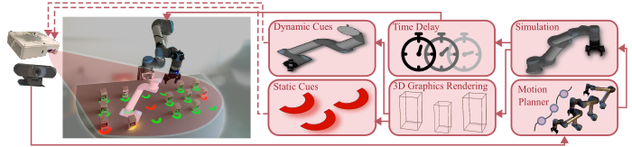

# Intention Projection Framework
---------------------------------------------------------

The Intention Projection Framework consist of enasamble of **ROS (1), Unity/Gazebo and OpenCV**. This codebase provides implimentation of human robot collaborative experiment used for **IROS 2023** submission: **"Projecting Robot Intentions Through Visual Cues:
Static vs. Dynamic Signaling"**

Proposed system architecture:



Information about the current state of the real world environment is captured using a camera. In turn, a robot motion planner generates the intended following actions. The result is used to produce 3D visualizations of either static visual cues or dynamic motion cues. Finally, generated visual signals are projected into the world using a projection device. In this work, we use the projected signals only for the robot actions. However, the designed mixed reality system can also show other signals such as human goals (green) shown in the left image.


Here are the designed visual modes viz. static and dynamic:


------------------------------------------------------------

Important part of intention projection framework is stereo calibration of camera-projector stereo setup. Any projector with high lumen (2000>) and fixed focus camera is preffered. In our case, we have used Optoma projector with ZED camera. User can use the following repository to install calibration software.
  * [https://github.com/ir-lab/scan3d_capture.git](https://github.com/ir-lab/scan3d_capture.git)

This software is only important to obtain projector's Intrinsic ($f_{x}, f_{y}, c_{x}, c_{y}$) and Extrinsic ($T = [R,t]$) w.r.t. to camera. Camera calibration can be separetely obtained using separate calibration process. In our case, we used ros-monocular calibration proecess. User can use following tutorial on how to calibrate camera. 

* http://wiki.ros.org/camera_calibration/Tutorials/MonocularCalibration 


Once obtained the calibration paramters for both camera and projector, place it in [configs](./configs) directory. 


As initial step, make sure to create virtual environment with python3.7 or above

* Install all dependencies inside a virtual envrionement.

    > Note: Make sure ZED sdk is installed at ***/usr/local/zed***

    ```
    bash install.sh
    ```
* Edit ***./configs/general_params.yaml*** to change initial parameters

---------------------------------------------------------


Implementation of visual cue visualization is done in [intpro.py](./src/intpro.py) script. This script uses **ROS and OpenCV** so make sure to start the roscore. Please make changes to the script as per your requiements. 

Unity simulation implementation can be found below:

* https://github.com/sdsonawani/unity_ur5_intpro


